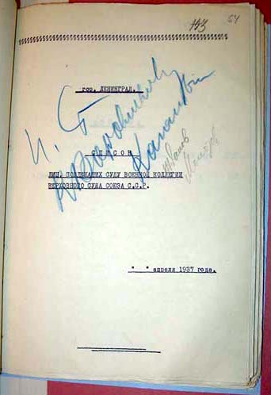

# stalin-lists

პროექტის დაწყების თარიღი: **06/03/2020**

## აღწერა

1937-1938 წლებში საქართველოს სსრ-ში სულ 29.051 ადამიანი იქნა რეპრესირებული, მათ შორის 14.372 დახვრეტილი,
14.679 - გადასახლებული. ჩვენი ბაზა შეიცავს 1937-1938 წლებში ე.წ. "სტალინური სიების" საფუძველზე რეპრესირებული 
3.616 პიროვნების მონაცემს, ვებ-გვერდი კი საშუალებას გაძლევთ დაათვალიეროთ ეს მონაცემები.

**მონაცემები მოწოდებულია [IDFI](https://idfi.ge/ge)-ს მიერ**.

## ავტორი

[თემური თაკალანძე](https://abgeo.dev)
